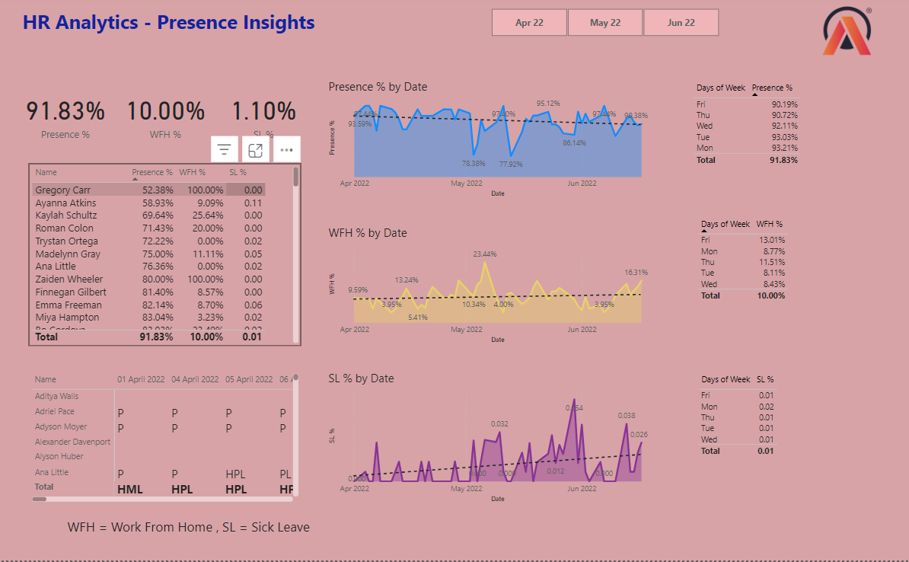

# HR-Analytics-Project-AtliQ-Hardware-
This project showcases how data-driven insights can transform HR decision-making at **AtliQ Hardware**. By utilizing **Power BI**, we turned complex HR data into actionable analytics, helping the organization effectively manage employee attendance and absenteeism across multiple locations. 

🏷️ Objective  
The HR department at AtliQ Hardware faced difficulties in tracking attendance and absenteeism trends across its branches. This project aimed to address those challenges by providing a centralized, interactive dashboard to analyze and visualize key workforce metrics.  

🌟 Key Features  
1. Data Cleaning and Preparation
   - Used **Power Query** to clean and preprocess raw HR data for analysis.  
   - Ensured data accuracy and consistency for reliable insights.  

2. KPI Development
   - Generated critical metrics, such as:  
     - Employee Attendance Rate  
     - Sick Leave Percentage  
     - Remote Work Percentage  

3. Trend and Pattern Analysis 
   - Identified attendance patterns by day of the week and over time.  
   - Highlighted shifts in work preferences, such as increased adoption of remote work.  

4. Interactive Dashboard
   - Built a visually intuitive Power BI dashboard to enable:  
   - Dynamic filtering by branch, department, and time period.  
   - Easy identification of key trends and actionable areas.  

🔍 Insights Derived  

- Attendance Decline: Noticed a slight reduction in overall attendance, counterbalanced by a rise in remote work.  
- Sick Leave Patterns: Mondays recorded the highest sick leave rates, signaling potential workload or morale issues.  
- Optimal Engagement Days: Tuesdays emerged as the day with the highest attendance, suggesting a midweek peak in productivity.  
- Remote Work Preference: Fridays were the most popular for remote work, reflecting a trend toward flexible work arrangements.  

📊 Dashboard Highlights  

The Power BI dashboard provides an at-a-glance view of:  
- Attendance and absenteeism trends over time.  
- Day-wise performance and branch-level comparisons.  
- Customizable filters for deeper analysis.

  

  🙌 Acknowledgments  

- Dhaval and Hemanand Sir: For their invaluable mentorship and insights.  
- **Codebasics**: For providing high-quality educational resources that supported this project. 

Open the Power BI File
Launch HR Analytics Atliq.pbix in Power BI Desktop.
Explore the Dashboard
Use the interactive filters to view attendance trends, sick leave percentages, and remote work patterns.
